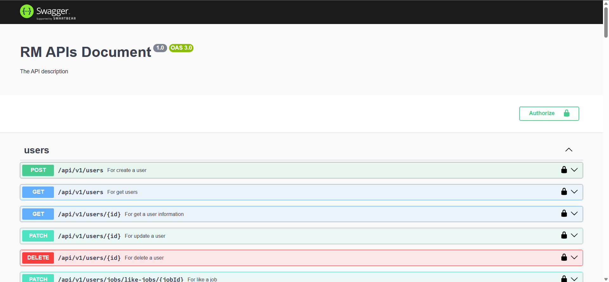
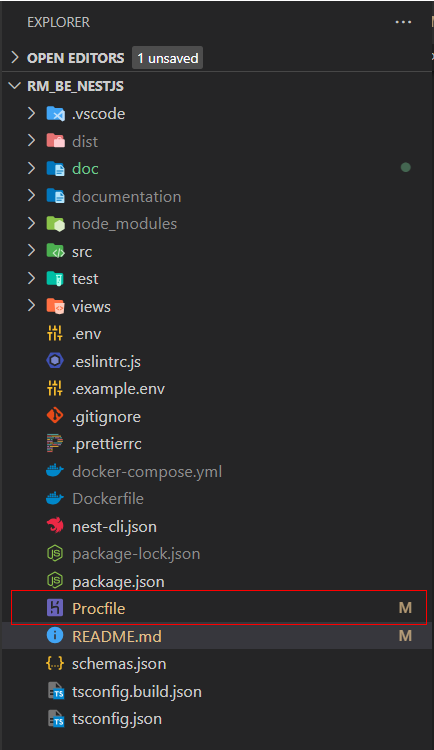
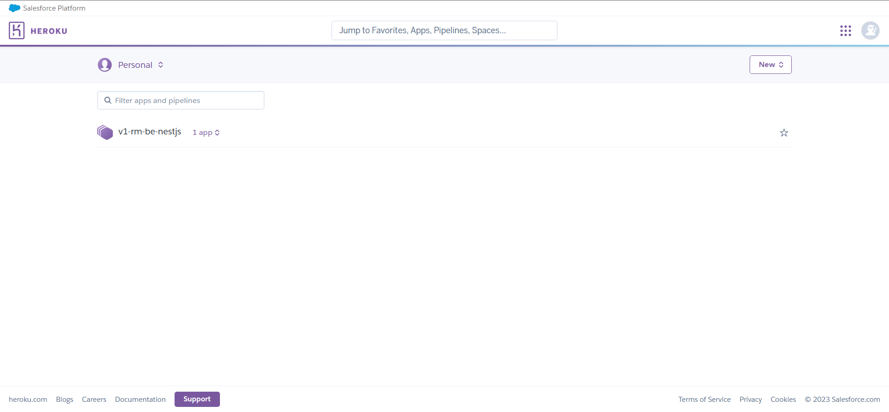
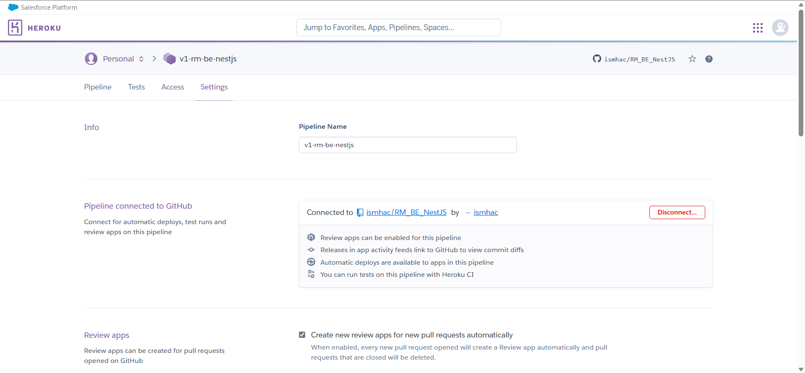
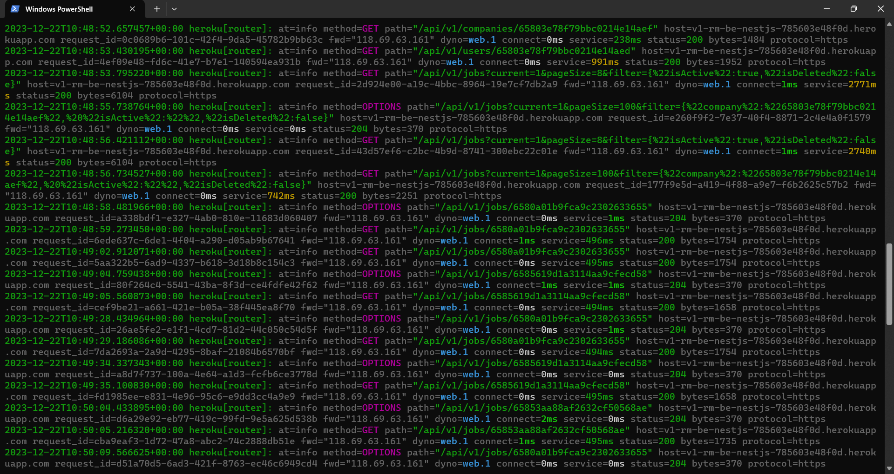

## Description
Project builds API for recruitment and job search websites. Using NestJS Framework, combined with MongoDb database to store data.
---
### How to install?
Required: NodeJS version >= 16.20.0 

1. Clone or download source code <a href ="https://github.com/ismhac/RM_BE_NestJS">here</a>
2. Install package:

<br>with <b>npm</b>:
```bash
npm install
```
or with <b>yarn</b>:
```bash
yarn
```
---
### Config .env file
Add necessary values ​​to the .env file:
```
PORT =  
MONGO_URL = 
JWT_ACCESS_TOKEN_SECRET = 
JWT_ACCESS_EXPIRE = 
JWT_REFRESH_TOKEN_SECRET = 
JWT_REFRESH_EXPIRE = 
EMAIL_HOST = 
EMAIL_AUTH_USER= 
EMAIL_AUTH_PASS =
EMAIL_PREVIEW = 
CLIENT_ID = 
CLIENT_SECRET = 
REFRESH_URI = 
REFRESH_TOKEN = 
FOLDER_NAME = 
SHOULD_INIT = 
INIT_PASSWORD_ADMIN = 
INIT_PASSWORD_USER = 
INIT_PASSWORD_HR = 
```
---
### How to run?
with <b>npm</b>:
```bash
npm run dev
```
or
```bash
npm run build
```
then 
```bash
npm run start:prod
```
with <b>yarn</b>:
```bash
yarn run dev
```
or
```bash
yarn run build
```
then
```bash
yarn run start:prod
```
---
### Try the API on swagger?
After running the program successfully, you can access the link <a>http://localhost:[PORT]/swagger to try out the APIs <br><br>


---

### Deploy with Heroku
1. create <b> Procfile<b> and config:
```javascript
build: npm run build
web: npm run start:prod
```


2. Sign up, login and create new app on <a href="https://dashboard.heroku.com/apps">Heroku</a>:



3. Config with <a href="https://dashboard.heroku.com/apps">Heroku</a>, view details <a href="https://github.com/marketplace/actions/deploy-to-heroku">here</a>:



4. install and run Heroku CLI to check logs:
```bash
heroku logs --tail --app app_name
```


---